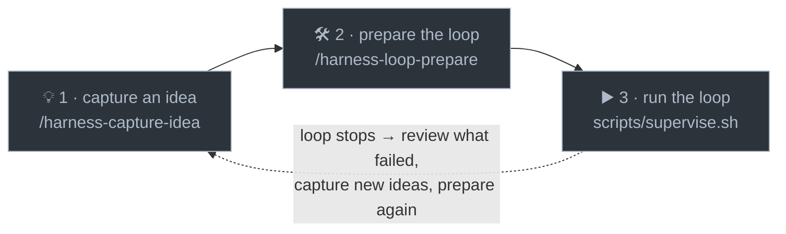

# implementation-harness

> An autonomous build loop for Claude Code. You give it a backlog of ideas and it builds them one
> fully-verified task at a time: cheapest model first, gated on green CI, running hands-off for hours
> or days.

You work with it in **three steps**:

1. **💡 Capture an idea.** Run `/harness-capture-idea` whenever one strikes. It just gets saved, no
   ceremony.
2. **🛠️ Prepare the loop.** Run `/harness-loop-prepare`. One command turns your ideas (and any past
   failures) into a vetted, ready-to-build backlog.
3. **▶️ Run the loop.** Start `.harness/scripts/supervise.sh` from a terminal and walk away.



That is the whole cycle. The rest of this page is detail.

> Not the same as Anthropic's official **`ralph-loop`** plugin (the simpler "Ralph Wiggum" while-true
> technique). This is the fuller task-by-task, CI-gated harness.

## What makes it good

- **🪜 Weakest model first.** Every task starts on the cheapest tier and only moves up to a stronger
  model when the cheap one actually fails, so you are not paying for a big model by default.
- **🧠 Learns which tier to use.** It calibrates the right starting tier for each kind of task from real
  pass/fail results, so the choice gets better over time. You never configure a model per task.
- **🔎 Re-tests cheaper tiers over time.** An optional probe checks whether a newly-added or
  previously-too-weak model can now handle a class of task, for example as your codebase matures, so it
  never stays pinned to an expensive tier out of habit.
- **✅ "Done" means done.** A task passes only when it builds, tests pass, GitHub CI is green, and
  (optionally) the change is seen actually running. A sampled blind audit can still overturn a false
  success.
- **🩺 Failures become better tasks.** When a task truly dead-ends, or you overturn a success it got
  wrong, the review step works out why and rewrites it as a sharper follow-up instead of re-queuing the
  same spec.
- **🔒 Human-gated steps.** Work that needs a person (credentials, provisioning, anything that spends
  real money) is marked, prepared, and handed to you. The loop never fakes it.
- **♻️ Interrupt-safe.** All state lives in the repo and one task runs at a time, so stopping mid-run
  (or a crash) wastes at most one task.
- **📊 Portable dashboard.** A dependency-free local web view of the backlog, live loop status, and the
  model-calibration internals.

## Install

```
/plugin marketplace add RyanMKrol/claude-skills
/plugin install implementation-harness@claude-skills
```

Then, in any repo, run **`/implementation-harness:create`** (or just ask Claude to "set up the
implementation harness here"). It asks you a few questions (your stack, your test and build commands,
worktree vs in-place isolation) and scaffolds a self-contained `.harness/` folder plus a starter
backlog. Do this once per project.

## Use it

The three steps, in a little more detail:

1. **Capture.** `/harness-capture-idea <idea>` adds the idea to an inbox and stops. No questions; save
   it and get back to what you were doing.
2. **Prepare.** `/harness-loop-prepare` gets the backlog run-ready in one command. It reviews anything
   the last run left failed, converts your inbox into small, self-contained tasks (asking you the
   questions that matter), checks the backlog is sound, and ends on a GO / NO-GO. It never starts the
   loop.
3. **Run.** Start `.harness/scripts/supervise.sh` from a real terminal. It builds task after task for
   as long as you leave it running. **Only a human can start it:** the loop refuses to run from inside a
   Claude Code session, so an agent cannot kick off an unattended run that changes git history. To
   preview the next task without building it, run `DRY_RUN=1 .harness/scripts/loop.sh`.

**Watch it work.** While the loop is running (and afterwards), open the dashboard to follow along and
review what it has built:

```
node .harness/dashboard/server.js     # then open http://127.0.0.1:4790
```

- **What the loop is doing right now:** a live strip showing the current task, phase, and model, with
  the builder's output streaming in as it works.
- **What the loop has done:** the backlog by bucket (ready, waiting, needs-you, done), each finished
  task showing the model that completed it, and the tasks parked for you under "needs you".

When a run ends, the tasks it left failed or blocked feed back into **step 2**, where `loop-prepare`
reviews them and folds in any new ideas before the next run. That is the loop.

The complete operating manual (every command, the dashboard, the gates) is
[`templates/README.md`](./templates/README.md), which is scaffolded into your project as
`.harness/README.md`. The full design lives in `.harness/docs/HARNESS.md`.

## Upgrade

```
/implementation-harness:upgrade
```

Pulls newer harness versions into an existing `.harness/`. It refreshes the plugin-owned files, adds
new config knobs without touching your own values, and shows you every change before applying it. It
can also adopt older hand-forked installs. To refresh the plugin itself first, update it from the
marketplace or use [`freshen-up`](../freshen-up).

## Other commands

Beyond the three core steps, a few extras are there when you need them:

- **`/implementation-harness:customize`** turns on optional extension points (lifecycle hooks, a
  secret-guard denylist, visual verification, a dashboard title).
- **`/implementation-harness:evaluate-fit`** studies the project and tunes the harness config to fit it.
- **`/implementation-harness:report-issue`** files a bug against this plugin.
- Inside a scaffolded project you also get `/harness-add-to-backlog` (author tasks directly),
  `/harness-loop-recover` (clean up after a manual Ctrl-C), and `/harness-update-ladder` (edit the model
  ladder). `loop-prepare` already runs the review, convert, and check steps for you, so you rarely call
  those by hand.

## Good to know

- **Requirements:** the `claude`, `gh` (GitHub CLI), `git`, and `jq` command-line tools, plus `node` for
  the dashboard. You also need a GitHub remote, since the gate is green GitHub CI.
- **Two isolation modes**, chosen at `create`: **worktree** (each task is built in an isolated sibling
  checkout) or **in-place** (works directly in your checkout; pick it when the build needs untracked or
  gitignored local state that a worktree cannot see).
- **Contributing:** `templates/` is the single source of truth for the scaffolded harness. See
  [`CLAUDE.md`](./CLAUDE.md) for the maintainer rules (version bump and migration ledger on every
  change).
