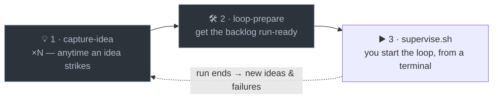
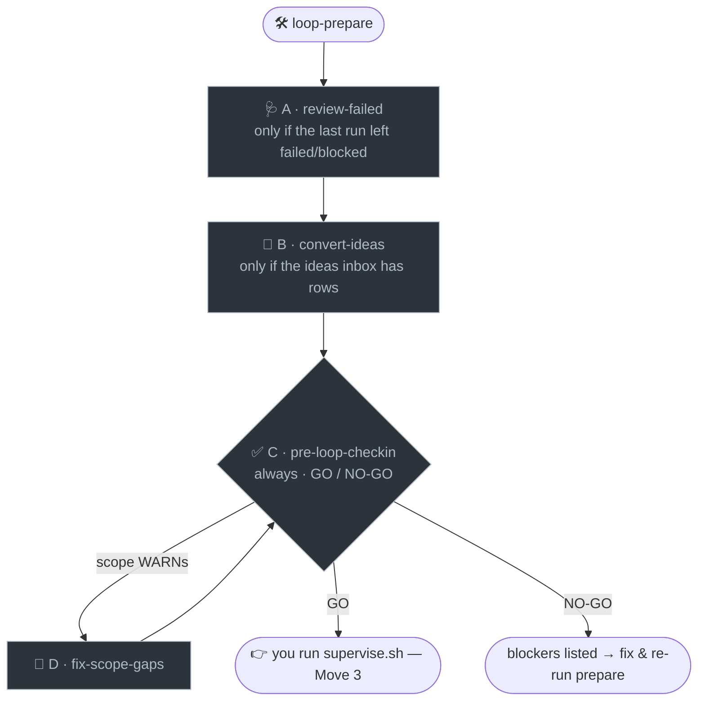

# implementation-harness

A personal Claude Code plugin that **scaffolds an autonomous implementation harness into any
project**, authors its task backlog, and operates it via fourteen skills (five global, nine
scaffolded per-project — see [Skills](#skills)).

The harness it installs (the "Ralph Loop") is a single **sequential** shell loop that builds a
`TASKS.json` backlog **one fully-verified task at a time** — fresh-context `claude -p` per task,
worktree **or** in-place isolation (chosen at scaffold), a **green-GitHub-CI merge gate**, a
**sampled blocking audit**, and `gate`/`needs-human` review stops. Difficulty (which model/effort
to build a task at) is **data-driven auto-tuning**: the policy starts every task at the cheapest
tier and escalates up a global ladder on repeated failure, learning per-kind-of-task which tier
reliably works. All durable state lives in the repo, so an interrupted run wastes at most one task.

> Distinct from Anthropic's official **`ralph-loop`** plugin, which implements the simpler
> "Ralph Wiggum" while-true technique. This one is the fuller task-by-task, CI-gated harness.

## How you work with it — three moves

After a one-time `create`, running the harness is **three moves**:

1. **Capture ideas** — `/harness-capture-idea <idea>`, as often as you like, whenever a thought
   strikes.
2. **Prepare the run** — `/harness-loop-prepare`, one command that turns your accumulated ideas
   (and any failures from the last run) into a vetted, run-ready backlog.
3. **Start the loop** — `.harness/scripts/supervise.sh`, which you launch yourself from a real
   terminal and leave running.



That's the whole cycle. Everything else the harness does lives **under the hood** of those three
moves — expanded below.

### One-time — scaffold it

`/implementation-harness:create` interviews you (isolation mode, stack, format/lint/test/build
commands, CI name, cold-start difficulty floor) and writes a self-contained `.harness/` plus a
personalized `CLAUDE.md`, `ci.yml`, `harness.env`, and starter `TASKS.json`. Do this once per repo.

### Move 1 — capture ideas (zero ceremony)

`/harness-capture-idea <idea>` appends one row to `.harness/tracking/IDEAS.jsonl` and stops. No
interview, no decomposition, no `TASKS.json` write. It **deliberately defers every question** to
`loop-prepare`'s conversion stage — which is exactly why that stage is where the questioning
concentrates. Capture the instant the thought strikes; don't break your flow.

### Move 2 — prepare the run (what `loop-prepare` does under the hood)

`/harness-loop-prepare` is the single command that gets the backlog run-ready. It **chains four
existing skills in order, running each in full — every question and guardrail preserved** (it
streamlines nothing away; the planning stage is the only cheap place to resolve ambiguity):



- **A · review-failed** *(skipped if nothing failed)* — investigates each `failed`/`blocked` task's
  root cause (one sub-agent per task) and authors a demonstrably-better follow-up — **never a blind
  retry**. Runs first, so its follow-ups are already in the backlog for the later stages.
- **B · convert-ideas** *(skipped if the inbox is empty)* — sweeps the **whole** `IDEAS.jsonl`
  inbox: dedupes related ideas, fans out one sub-agent per idea/cluster to shape it into atomic,
  dependency-ordered tasks, **batches any genuine open questions back to you** (always confirming
  the definition of done), then runs the locked `consolidate-ideas.sh` pass that allocates real
  task ids, writes each spec, appends to `TASKS.json`, and clears the converted rows.
- **C · pre-loop-checkin** *(always)* — a strictly **read-only** GO/NO-GO: needs-human blockers,
  session hygiene (dirty tree, a running loop, a held lock), dependency short-circuits, and per-task
  facet/spec/scope quality. It changes nothing — it just tells you whether the loop is safe to start.
- **D · fix-scope-gaps** *(only when the check-in's scope check WARNs)* — offered right there; fans
  out a cheap-model judge per warning (real-gap vs false-positive against the spec's own prose),
  auto-applies the confident real gaps to each task's `scope`, and asks you only about the ambiguous
  ones.

`loop-prepare` ends at the **GO / NO-GO** verdict and **never starts the loop**. You can still run
any of A–D as its own command when you want just that step (e.g. `/harness-convert-ideas` mid-week),
but to prepare a run, `loop-prepare` is the single entry point.

### Move 3 — run the loop (you, from a real terminal)

`.harness/scripts/supervise.sh` is a foreground heartbeat that re-runs `.harness/scripts/loop.sh`
on a cadence for days; `loop.sh` builds one fully-verified task at a time, cheapest-tier-first with
auto-escalation, gated on green GitHub CI. **Only a human can start it** — `supervise.sh`/`loop.sh`
hard-refuse the moment they detect they're being invoked from inside a Claude Code session, so an
agent can never kick off an unattended, git-mutating run on its own. Preview first with
`DRY_RUN=1 .harness/scripts/loop.sh`.

Under the hood, each pass is a four-beat cycle:

```
supervise.sh (heartbeat, runs for days)
  └─ loop.sh   ── one task at a time, in isolation:
        SELECT  next eligible task from origin/main (deps met, not gated)
        WORK    one `claude -p` builds it, runs the Definition of Done, pushes a branch
        GATE    watch GitHub CI on that branch → green? fast-forward main : fix on resume
        RECORD  refresh the zero-token status board, repeat
```

When the run ends (or you stop it), the tasks it left `failed`/`blocked` plus whatever new ideas
you've captured feed straight back into **Move 2** — the dashed arrow in the first diagram.

### Supporting skills

Outside the main happy path:

- `/harness-add-to-backlog <feature>` — author tasks **directly** from a feature
  description, skipping the ideas inbox (a focused interview → atomic `TASKS.json` tasks).
- `/harness-loop-recover` — clean up after a **manual** interrupt (Ctrl-C / killed
  loop): orphaned tasks, stale locks, a dirty tree or leftover worktree, ledger noise.
- `/harness-update-ladder` — add/swap/remove a model+effort rung on the difficulty
  tier ladder.
- `/implementation-harness:customize` — walk the `custom/` overlay
  extension-point catalog (conventions, lifecycle hooks, secret-guard, visual-verify, dashboard
  title) and activate what you want.
- `/implementation-harness:evaluate-fit` — deep-dive this project and
  tune the harness to it (the `custom/` overlay, `harness.env` knobs, and `facets.json`) — useful
  after scaffolding against a young repo, or once the project has grown.
- `/implementation-harness:upgrade` — pull newer plugin versions into an
  existing install (also adopts legacy/hand-forked installs).

## Skills

Five **global** skills (plugin-registered — invoke with the `implementation-harness:` prefix from
any project) bootstrap, tune, and reconcile a harness install (and file bug reports upstream):

| Skill | Invoke | What it does |
|---|---|---|
| `implementation-harness:create` | `/implementation-harness:create [dir]` | One-time setup. Interview (isolation mode — worktree vs in-place, name, stack, format/lint/test/build commands, CI name, cold-start difficulty floor, optional run/backtest check), then copy the verbatim harness files (including the nine project-local skills below) and write the personalized `CLAUDE.md`, `ci.yml`, `.gitignore`, `harness.env`, `README.md`, and an initial `TASKS.json`. Leaves the project ready to run `.harness/scripts/supervise.sh`. |
| `implementation-harness:customize` | `/implementation-harness:customize` | Guided walkthrough of the `custom/` extension-point catalog (lifecycle hooks, secret-guard denylist, visual-verify snippets, build/audit preambles, dashboard title, …) — activates the opt-in file and helps draft its content for each feature the user wants. |
| `implementation-harness:evaluate-fit` | `/implementation-harness:evaluate-fit` | Checks whether an already-installed harness is well-tuned to *this* project and fixes mismatches. Runs a multi-agent deep-dive of the repo (stack, module structure, risk profile, deploy/notify story, secret + visual surfaces), reads the current config, then produces ranked, evidence-backed recommendations across the only customizable surfaces — the `custom/` overlay, `harness.env` knobs, and `facets.json` — and applies them on approval. Never edits harness mechanism. |
| `implementation-harness:upgrade` | `/implementation-harness:upgrade [dir]` | Reconciles an installed `.harness/` (and the nine project-local skills below) against the plugin's bundled reference — refreshes plugin-owned mechanism files, adds new `harness.env` knobs additively, reports first and asks before every change. Also adopts legacy/hand-forked installs. |
| `implementation-harness:report-issue` | `/implementation-harness:report-issue` | Files a bug report about the plugin itself as a GitHub issue on `RyanMKrol/claude-skills`. Auto-captures the environment (plugin version, loop variant, bash/OS, tooling), synthesises the session, pushes for logs, scrubs secrets, does a real-bug-vs-misconfig plausibility check, then shows the full draft and files it via `gh` on explicit confirmation. Works with or without a scaffolded `.harness/`. |

Nine **project-local** skills (scaffolded by `create` into your project's own `.claude/skills/`,
kept in sync by `upgrade` — invoke bare, no prefix — so their logic can never drift ahead of what
this specific project's `.harness/` version understands) operate a harness that's already installed:

| Skill | Invoke | What it does |
|---|---|---|
| `harness-capture-idea` | `/harness-capture-idea <idea>` | Zero-ceremony: appends one `{id,title,description,capturedAt}` row to the committed `tracking/IDEAS.jsonl` inbox. No interview, no `TASKS.json` write — defers all questions to `convert-ideas`. |
| `harness-convert-ideas` | `/harness-convert-ideas` | Sweeps the whole ideas inbox at once — dedupes, converts each idea/cluster in parallel via its own sub-agent, relays any open questions in one batch, then runs the locked `consolidate-ideas.sh` pass into `TASKS.json`. |
| `harness-pre-loop-checkin` | `/harness-pre-loop-checkin [id]` | Read-only GO/NO-GO before an unattended run: needs-human blockers, session hygiene, dependency short-circuits, and per-task facets/spec/scope quality. Changes nothing; offers `fix-scope-gaps` if scope check (e) WARNs. |
| `harness-fix-scope-gaps` | *offered by `pre-loop-checkin`* | Follow-up to the check-in's scope check: fans out one cheap-model judge per WARN (real-gap vs false-positive against the spec), auto-applies confident gaps to each task's `scope`, asks only on ambiguity. Not meant to be run blind. |
| `harness-add-to-backlog` | `/harness-add-to-backlog [feature]` | Repeatable. Focused interview that turns a feature/phase into atomic, dependency-ordered `TASKS.json` task objects (schema in `.harness/docs/HARNESS.md` §8.1) with auto-tuned difficulty (`facets`) and `gate`/`needs-human` markers — appended (via `jq`) without disturbing existing tasks. |
| `harness-review-failed` | `/harness-review-failed [id]` | Sweeps every `failed`/`blocked` task, investigates the root cause (one sub-agent each, in parallel), and authors a demonstrably-better follow-up via the same `consolidate-ideas.sh` pipeline. Never a blind retry; never touches the terminal task's status. |
| `harness-loop-recover` | `/harness-loop-recover [id]` | Recovers the loop after a manual interrupt: stops-check, surgical dirty-tree / leftover-worktree cleanup, stale-lock clearing, orphaned-task detection + fix (verified against the DoD), ledger-noise cleanup, then a readiness check. Mutates + pushes — the correcting the stopped loop can't do. |
| `harness-update-ladder` | `/harness-update-ladder [model]` | Add, swap, or remove a rung on this project's difficulty/tier ladder (`config/facets.json`) — handles effort-less models (`effort: null`) and walks the right migration path for a swap vs an insert/remove. |
| `harness-loop-prepare` | `/harness-loop-prepare` | Prepare the next unattended run as one command: chains `review-failed` (if the last run left failed/blocked tasks) → `convert-ideas` (if the inbox has rows) → `pre-loop-checkin` → `fix-scope-gaps` (on WARNs), executing each constituent skill in full — every question preserved — and ending at the GO/NO-GO verdict. Never starts the loop. |

All fourteen are also model-invocable (Claude triggers them from the descriptions when you ask in
plain language) — the five global ones from any project, the nine project-local ones once
scaffolded into that project.

## Layout

```
implementation-harness/
├── .claude-plugin/plugin.json
├── README.md
├── skills/                     ← global, plugin-registered (dirs are bare; invoked colon-prefixed,
│   │                             e.g. skills/create → /implementation-harness:create)
│   ├── create/SKILL.md
│   ├── customize/SKILL.md
│   ├── evaluate-fit/SKILL.md
│   ├── report-issue/SKILL.md
│   └── upgrade/{SKILL.md,MIGRATIONS.md,CHECKSUMS.jsonl,gen-checksums.sh}
└── templates/                 ← the harness itself (single source of truth), vendored here
    ├── skills/                 ← sources for the nine project-local skills (scaffolded to
    │                             <project>/.claude/skills/harness-<name>/SKILL.md
    │                             by create, kept in sync by upgrade)
    │   ├── harness-add-to-backlog/SKILL.md
    │   ├── harness-capture-idea/SKILL.md
    │   ├── harness-convert-ideas/SKILL.md
    │   ├── harness-fix-scope-gaps/SKILL.md
    │   ├── harness-loop-prepare/SKILL.md
    │   ├── harness-loop-recover/SKILL.md
    │   ├── harness-pre-loop-checkin/SKILL.md
    │   ├── harness-review-failed/SKILL.md
    │   └── harness-update-ladder/SKILL.md
    ├── config/{harness.env,facets.json}
    ├── docs/{HARNESS,LIMITATIONS}.md, docs/designs/*.md
    ├── ledgers/                (outcomes.jsonl, failures.jsonl — seeded empty, committed)
    ├── scripts/                loop.sh, loop.in-place.sh, supervise.sh, postflight.sh,
    │                           repo-lock.sh, policy.jq, mark-{done,failed,reviewed}.sh (+ tests),
    │                           check-task-scope.sh, consolidate-ideas.{sh,mjs}
    ├── dashboard/              server.js, lib.js, lib.test.js — portable backlog viewer
    ├── tasks/                  per-task Markdown specs (## Do / ## Done when)
    ├── tracking/               TASKS.json, IDEAS.jsonl, human-done/manual-fail/reviews.json
    ├── custom/                 upgrade-safe overlay (prose companions + hooks/guard extension points)
    ├── .pending-tasks/, .pending-questions/   ideas-pipeline scratch dirs
    ├── worklog/.gitkeep
    ├── .github/workflows/ci.yml
    └── CLAUDE.md, harness-CLAUDE.md, README.md, gitignore   (gitignore ships dot-less; written as .gitignore on scaffold)
```

`templates/` is the **single source of truth** for the harness — iterate on the harness here.
Bump `plugin.json` `version` when the templates change. The authoritative design of the harness
itself is `templates/docs/HARNESS.md`; the owner-overlay/dashboard mechanism is
`templates/docs/designs/manual-fail-signal.md`.

## Install (once)

```
/plugin marketplace add RyanMKrol/claude-skills
/plugin install implementation-harness@claude-skills
```

(For local development on the plugin itself, point the marketplace at a checkout instead:
`/plugin marketplace add ~/Development/claude-skills`.)

Then it's available in every project. Use it by running
`/implementation-harness:create` inside a repo, or just asking Claude to "set
up the implementation harness here".

## Notes

- The shipped `templates/.github/workflows/ci.yml` **fails on purpose** (an `exit 1` placeholder)
  until `implementation-harness:create` replaces its steps with your real
  Definition-of-Done commands — so an un-personalized harness can never silently pass CI.
- The loop integrates by pushing to `origin/main`; a GitHub remote is required when
  `REQUIRE_CI=1` (the default).
- `loop.sh` and `postflight.sh` parse `TASKS.json` with **`jq`** — the scaffolded project needs it
  on PATH (`brew install jq`). The dashboard and the ideas-pipeline consolidation script need
  **`node`** — a harness-tooling dependency independent of the target project's own stack.
- `loop.sh` derives its worktree/lock name from the repo directory basename — nothing to configure.
- **Two isolation variants.** The default **worktree** loop builds each task in an isolated sibling
  worktree off `origin/main` (it only sees tracked files). The **in-place** loop works directly on
  `main` in the primary checkout — pick it when the build/verify needs **untracked or gitignored
  local state** (private code, local datasets, secrets-driven tests) a worktree can't see;
  `create-harness` asks and installs the right one as `.harness/scripts/loop.sh`. In-place adds a
  load-bearing pre-push sensitive-path guard (self-testable via
  `.harness/scripts/loop.sh --guard-selftest`) plus rate-limit auto-resume. See
  `templates/docs/HARNESS.md` "In-place variant".
- **Owner overlays + dashboard.** `mark-done.sh`/`mark-failed.sh`/`mark-reviewed.sh` (and the
  dashboard's buttons, which shell out to the same scripts) let a human correct or advance the
  backlog without ever hand-editing `TASKS.json` — see `templates/docs/designs/manual-fail-signal.md`.
  Run the dashboard with `node .harness/dashboard/server.js` (binds `127.0.0.1:4790`).
- Optional **`INTEGRATE_HOOK`** (in `config/harness.env`) runs a deploy/restart command after each
  task integrates, so the running product matches `main`.
