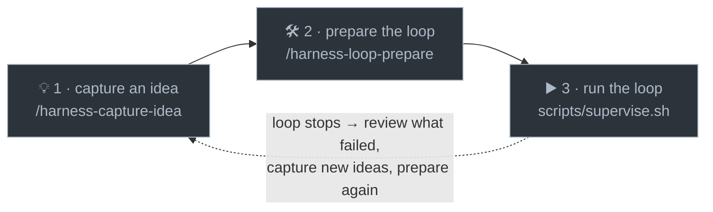

# implementation-harness

> An autonomous build loop for Claude Code. You feed it a backlog of ideas; it builds them one
> fully-verified task at a time — cheapest model first, gated on green CI, hands-off for hours or days.

You work with it in **three steps**:

1. **💡 Capture an idea** — `/harness-capture-idea` · jot it down, zero ceremony, whenever one strikes.
2. **🛠️ Prepare the loop** — `/harness-loop-prepare` · one command turns your ideas (and any past
   failures) into a vetted, ready-to-build backlog.
3. **▶️ Run the loop** — `.harness/scripts/supervise.sh` · you start it from a terminal and walk away.



That's the whole cycle. Everything else is under the hood.

> Not the same as Anthropic's official **`ralph-loop`** plugin (the simpler "Ralph Wiggum" while-true
> technique). This is the fuller task-by-task, CI-gated harness.

## What makes it good

- **🪜 Weakest model first.** Every task starts on the cheapest tier; it escalates up the ladder to a
  stronger model only when the cheap one actually fails — so you don't pay for a big model by default.
- **🧠 Learns which tier to use.** From real pass/fail outcomes it calibrates the right *starting* tier
  for each kind of task, so the choice gets smarter over time — no manual per-task model config.
- **🔎 Re-tests cheaper tiers over time.** An optional probe checks whether a newly-added or
  previously-too-weak model can now handle a class of task (e.g. as your codebase matures), so it never
  stays pinned to an expensive tier out of habit.
- **✅ "Done" means done.** A task passes only when it builds, tests pass, **GitHub CI is green**, and
  (optionally) the change is observed actually running — plus a sampled blind audit that can overturn a
  false success.
- **🩺 Failures become better tasks.** Dead-end tasks are investigated for root cause and rewritten as
  improved follow-ups — never blindly retried.
- **🔒 Human-gated steps.** Work that needs a person (credentials, provisioning, anything spending real
  money) is marked, prepared, and handed off — never faked.
- **♻️ Interrupt-safe.** All state lives in the repo and one task runs at a time, so stopping mid-run
  (or a crash) wastes at most one task.
- **📊 Portable dashboard.** A dependency-free local web view of the backlog, live loop status, and the
  model-calibration internals.

## Install

```
/plugin marketplace add RyanMKrol/claude-skills
/plugin install implementation-harness@claude-skills
```

Then, in any repo, run **`/implementation-harness:create`** (or just ask Claude to "set up the
implementation harness here"). It interviews you — your stack, your test/build commands, worktree vs
in-place isolation — and scaffolds a self-contained `.harness/` folder plus a starter backlog. Do this
once per project.

## Use it

The three steps, in a little more detail:

1. **Capture** — `/harness-capture-idea <idea>` appends the idea to an inbox and stops. No interview;
   capture and get back to what you were doing.
2. **Prepare** — `/harness-loop-prepare` gets the backlog run-ready in one command: it reviews anything
   the last run left failed, converts your inbox into atomic tasks (asking you the questions that
   matter), checks the backlog is sound, and ends on a GO / NO-GO. It never starts the loop.
3. **Run** — `.harness/scripts/supervise.sh`, from a real terminal. It builds task after task for as
   long as you leave it running. **Only a human can start it** — the loop refuses to run from inside a
   Claude Code session, so an agent can't kick off an unattended, git-mutating run. Preview the next
   task with `DRY_RUN=1 .harness/scripts/loop.sh`.

**Watch it work — the dashboard.** While the loop is running (and afterwards), open the dashboard to
follow along and review what it's built:

```
node .harness/dashboard/server.js     # then open http://127.0.0.1:4790
```

- **What the loop is doing right now** — a live strip showing the current task, phase, and model, with
  the builder's output streaming in as it goes.
- **What the loop has done** — the backlog by bucket (ready / waiting / needs-you / done), each finished
  task with the model that completed it, plus the tasks parked for you under "needs you".

When a run ends, the tasks it left failed or blocked feed back into **step 2** — `loop-prepare` reviews
them and folds in any new ideas before the next run. That's the loop.

The complete operating manual — every command, the dashboard, the gates — is
[`templates/README.md`](./templates/README.md), which is scaffolded into your project as
`.harness/README.md`; the full design lives in `.harness/docs/HARNESS.md`.

## Upgrade

```
/implementation-harness:upgrade
```

Pulls newer harness versions into an existing `.harness/` — refreshes the plugin-owned mechanism, adds
new config knobs without touching your values, and shows you every change before applying it (it also
adopts older hand-forked installs). To refresh the plugin itself first, update it from the marketplace
or use [`freshen-up`](../freshen-up).

## Other commands

Beyond the three core steps, a few extras are there when you need them:

- **`/implementation-harness:customize`** — turn on optional extension points (lifecycle hooks, a
  secret-guard denylist, visual verification, a dashboard title).
- **`/implementation-harness:evaluate-fit`** — deep-dive the project and tune the harness's config to it.
- **`/implementation-harness:report-issue`** — file a bug against this plugin.
- Inside a scaffolded project you also get `/harness-add-to-backlog` (author tasks directly),
  `/harness-loop-recover` (clean up after a manual Ctrl-C), and `/harness-update-ladder` (edit the model
  ladder). `loop-prepare` already runs the review/convert/check steps for you, so you rarely call those
  by hand.

## Good to know

- **Requirements:** the `claude`, `gh` (GitHub CLI), `git`, and `jq` CLIs, plus `node` for the
  dashboard — and a GitHub remote, since the gate is green GitHub CI.
- **Two isolation modes**, chosen at `create`: **worktree** (each task built in an isolated sibling
  checkout) or **in-place** (works directly in your checkout — pick it when the build needs
  untracked/gitignored local state a worktree can't see).
- **Contributing:** `templates/` is the single source of truth for the scaffolded harness; see
  [`CLAUDE.md`](./CLAUDE.md) for the maintainer rules (version bump + migration ledger on every change).
